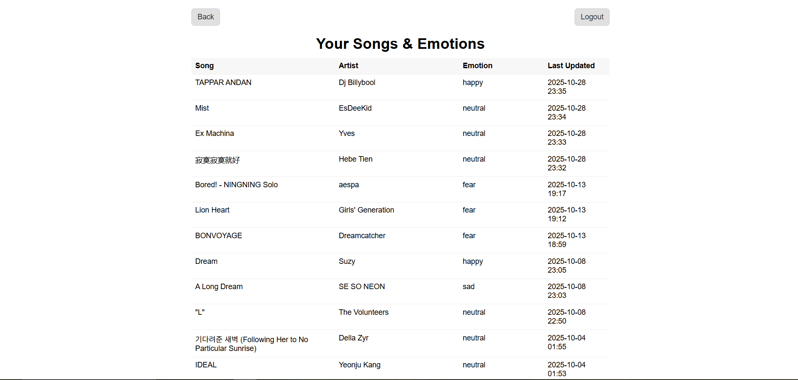
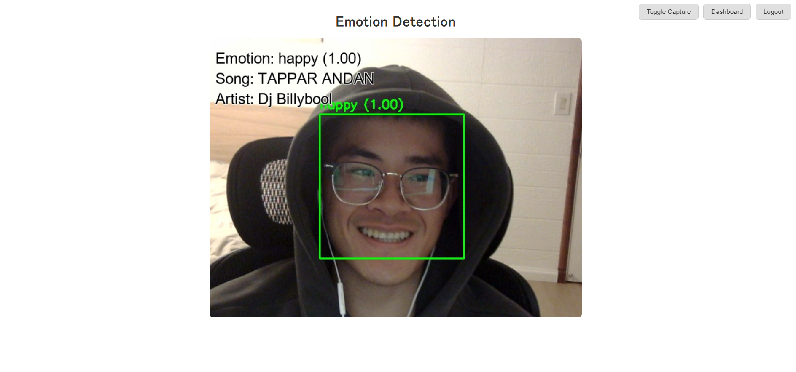

# Spotify-Emotion-Tracker

A small Python + Flask application that uses your webcam to detect your emotions in real time while you listen to Spotify.  
Each detected emotion is linked to the currently playing song and stored in Supabase, allowing you to see how your mood changes across your music taste.

---

## Features

- **Spotify Integration** – Tracks the song you're currently listening to.  
- **Real-Time Emotion Detection** – Uses your webcam and the `FER` library to identify facial expressions.  
- **Supabase Storage** – Saves each song's dominant emotion to your Supabase database.  
- **Live Camera Stream** – Displays emotion data and track info over a video feed.  
- **Automatic Emotion Updates** – Updates your emotion whenever the song changes.

---

## How It Works

1. When you start the app, your webcam activates.  
2. The app detects your facial emotion every frame.  
3. It checks your current Spotify song using your logged-in session.  
4. Each emotion is counted for the current song.  
5. When the song changes (or camera stops), the dominant emotion is saved to Supabase.

---

## Requirements

Install dependencies using:  

```bash
pip install -r requirements.txt
```

---

## Preview

Here’s what the app looks like in action:

### 🎵 Emotion and Song Dashboard


### 😀 Emotion Detection (Happy)

